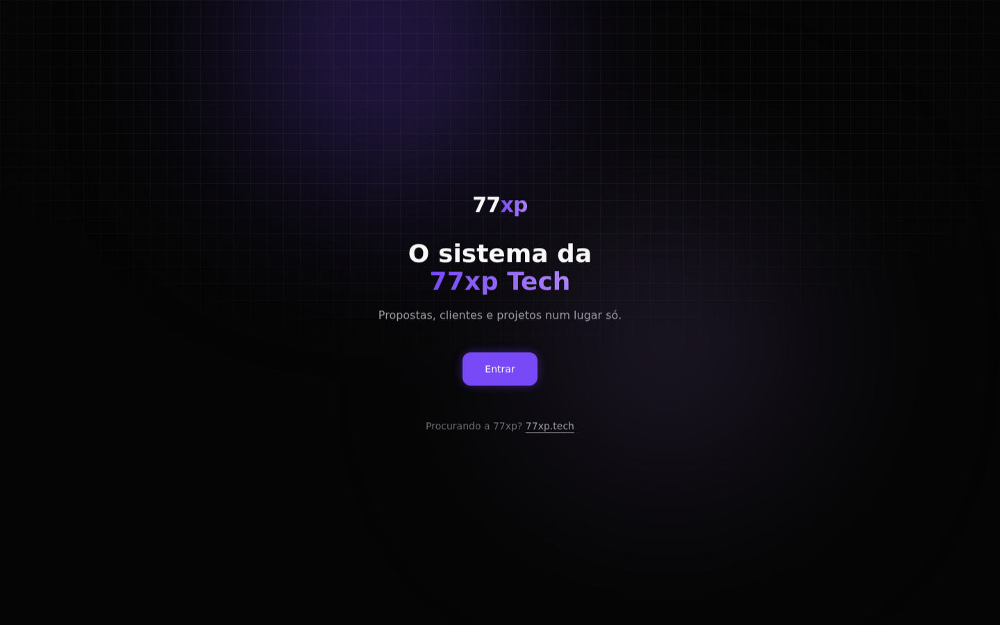
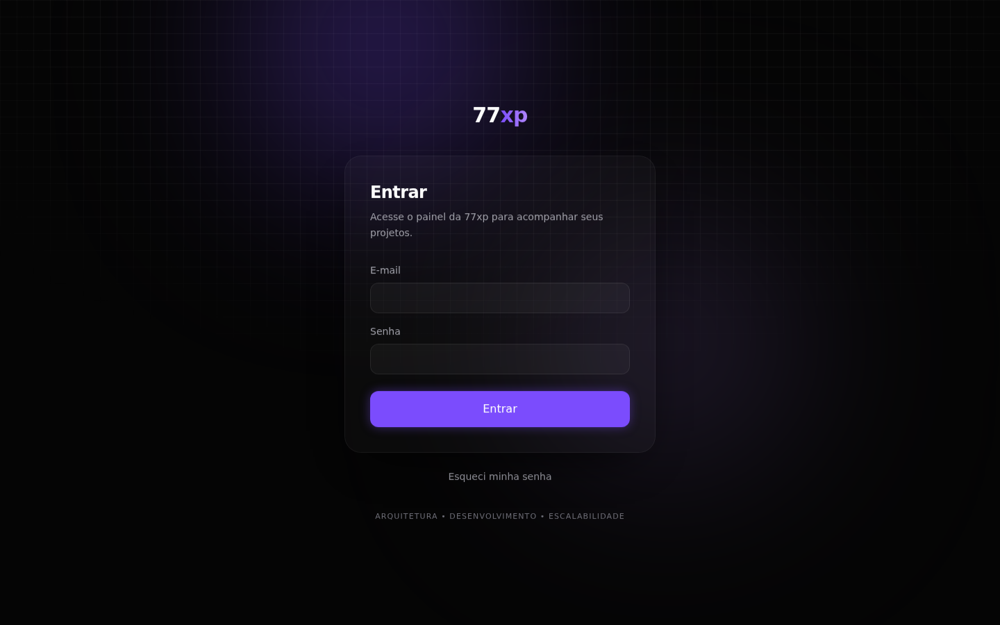
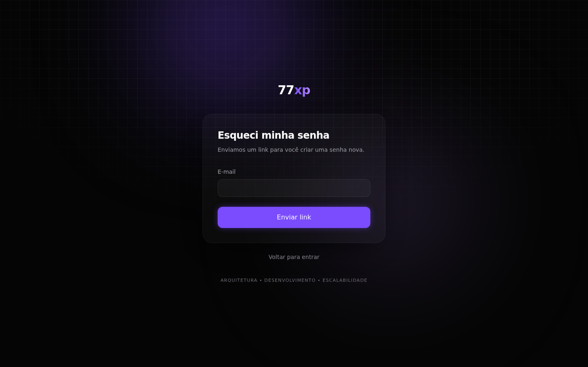
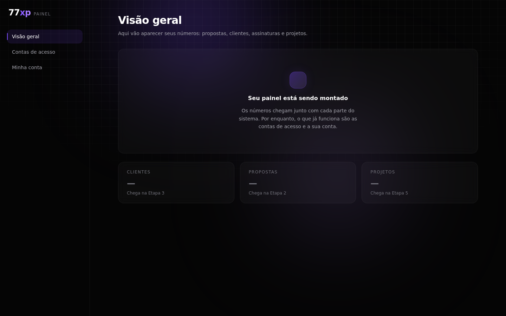
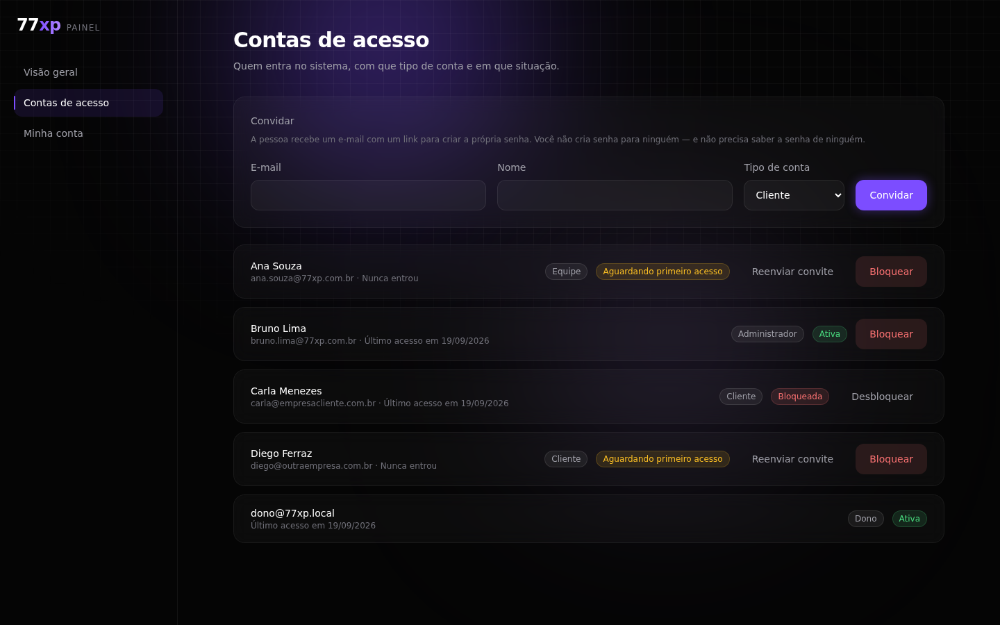
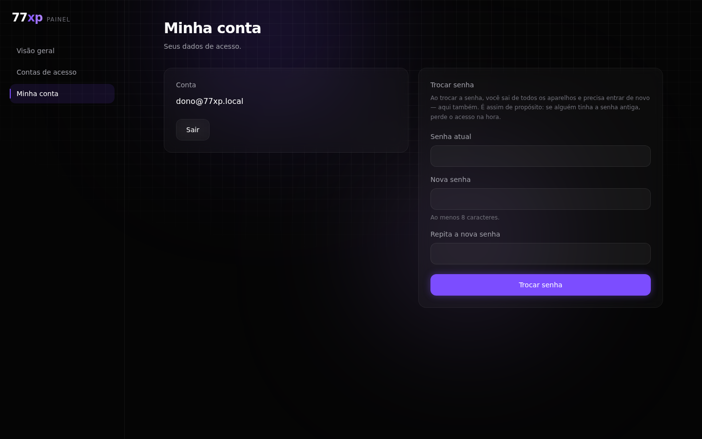
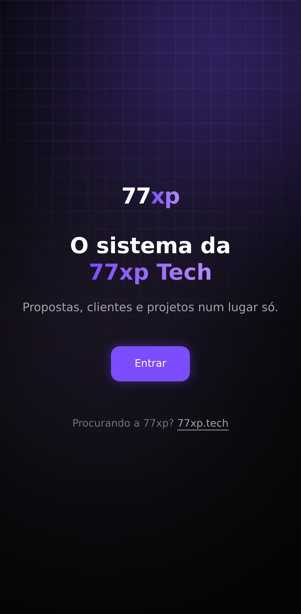
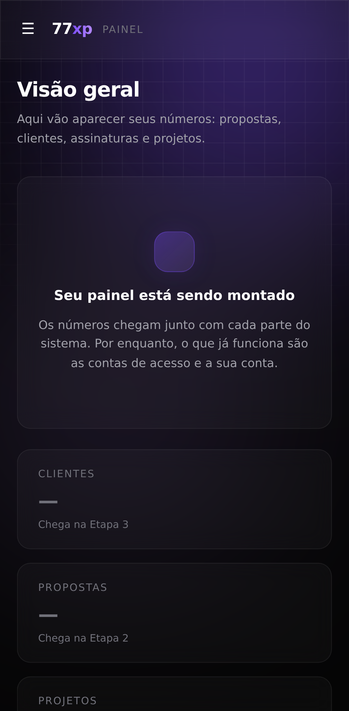
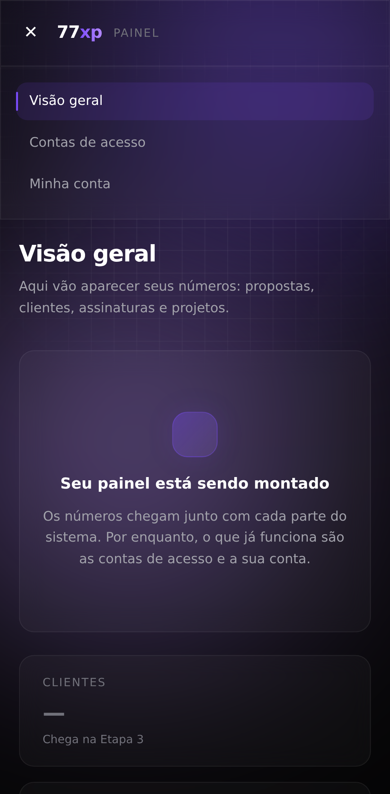
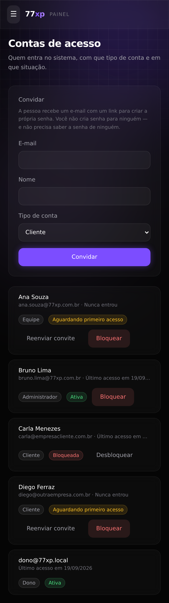

# Etapa 1 — Fundação

**Estado:** concluída
**Quando:** setembro de 2026
**Onde mora:** `os/backend` (Java) e `os/frontend` (React)

O que esta etapa entrega: **entrar no sistema com segurança**. Nada de propostas,
clientes ou projetos ainda — isso são as etapas 2 a 5. O que existe aqui é a base que
todo o resto vai usar: contas, senhas, sessões, e quem pode ver o quê.

---

## As telas

### Porta de entrada (`/`)



Não é a página de vendas — a página de vendas é o site 77xp.tech. Esta é a porta do
sistema, com um caminho para quem chegou aqui procurando a empresa. O texto dela existe
no arquivo HTML antes de o JavaScript rodar, então aparece na hora.

### Entrar (`/entrar`)



E-mail e senha. Erro de login **nunca** diz se o e-mail existe — sempre "E-mail ou senha
inválidos". Se alguém tentar adivinhar senha, depois de algumas tentativas a resposta
vira "Muitas tentativas. Tente de novo em um minuto".

Quem já tem sessão válida não vê esta tela: vai direto para o lugar dele.

### Esqueci minha senha (`/esqueci-a-senha`)



A resposta é **sempre** a mesma — "Se este e-mail tiver conta, enviamos o link" —
exista o e-mail ou não. Qualquer diferença aqui contaria para um estranho quais contas
existem.

### Painel — Visão geral (`/painel`)



Vazia de propósito, e dizendo isso. Os três cartões mostram em que etapa cada número
chega, em vez de fingir dados que não existem.

### Contas de acesso (`/painel/contas`)



Quem tem acesso, com que tipo de conta e em que situação:

- **Aguardando primeiro acesso** — foi convidado, ainda não criou a senha
- **Ativa** — usa o sistema
- **Bloqueada** — não entra

Convidar manda um e-mail com link para a pessoa criar a **própria** senha. Você nunca
cria senha para ninguém, e nunca precisa saber a senha de ninguém.

O tipo de conta que vem marcado é o **menos poderoso** (Cliente). Convidar um cliente
sem querer não custa nada; convidar um administrador sem querer entrega a organização.

Bloquear e desbloquear perguntam antes, dizendo o que vai acontecer.

Só dono e administrador veem esta tela.

### Minha conta (`/painel/conta`)



Trocar a senha pede a senha atual, mesmo com a sessão aberta: sessão aberta prova que a
pessoa entrou algum dia, não que é ela no teclado agora. Trocar a senha derruba todos os
aparelhos — a tela avisa antes.

### No celular

| Porta de entrada | Painel | Menu aberto |
|---|---|---|
|  |  |  |

O menu lateral vira barra de topo com ☰. Nenhuma tela passa da largura do celular — isso
é medido por teste, não conferido no olho.



---

## O que existe por baixo

### Quatro tipos de conta

| Tipo | Vê o quê |
|---|---|
| **Dono** | Tudo. Pode convidar administradores |
| **Administrador** | Tudo menos mexer no dono. Convida equipe e clientes |
| **Equipe** | O painel, sem as contas de acesso |
| **Cliente** | Só a área dele |

Esconder botão é conforto, não segurança: **quem recusa de verdade é a API**. Se um
cliente digitar `/painel/contas` na barra de endereço, a tela o manda de volta e a API
recusaria de qualquer jeito.

### Como a sessão funciona

O token que autoriza cada chamada **fica só na memória da aba** — nunca no
`localStorage`, onde qualquer script da página o leria. O token que renova a sessão vive
num cookie que o JavaScript não alcança.

Se duas abas tentassem renovar a sessão ao mesmo tempo com o mesmo token, o servidor
entenderia como token copiado e derrubaria todas as sessões. Por isso existe uma trava
entre abas.

### Separação entre organizações

Cada linha do banco pertence a uma organização, e o banco recusa mostrar linha de outra
organização — não por causa de um `WHERE` que alguém pode esquecer de escrever, mas por
regra do próprio PostgreSQL (Row Level Security). O usuário que a aplicação usa para
falar com o banco **não tem permissão de ignorar essa regra**.

### Nada some

Bloquear um vínculo não apaga a pessoa. Toda ação de administrador fica registrada numa
trilha que só aceita inserção — não dá para editar nem apagar o que já foi gravado.

---

## Como saber que funciona

Não é "deve funcionar". São **309 testes**, todos rodando em containers:

| O quê | Quantos | O que cobrem |
|---|---:|---|
| Backend | 236 | Banco, segurança, separação entre organizações, e-mail, trilha |
| Frontend | 67 | Telas, cliente HTTP, guardas de rota |
| Ponta a ponta | 6 | O caminho inteiro, com banco e e-mail de verdade |

O teste de ponta a ponta faz o que uma pessoa faria: o dono entra, convida um cliente,
o convite **chega no servidor de e-mail**, o cliente abre o link, cria a senha, entra na
área dele, e tenta o painel — e é barrado.

### Rodando na sua máquina

```bash
BOOTSTRAP_OWNER_EMAIL=seu@email docker compose -f os/docker-compose.yml up -d
```

| O quê | Endereço |
|---|---|
| Telas | http://localhost:5173 |
| API | http://localhost:8080/api/v1 |
| Caixa de e-mail | http://localhost:8025 |

Use **localhost**, não `127.0.0.1`: a API só libera `localhost` no modo de
desenvolvimento, e com o outro endereço o login falha sem explicar por quê.

A suíte completa do backend:

```bash
docker compose -f os/docker-compose.yml run --rm backend-tests
```

---

## Refazendo as fotos desta página

Quando as telas mudarem, as imagens acima ficam mentindo em silêncio. Por isso elas não
foram tiradas à mão: existe um script que refaz todas.

```bash
cd os/frontend
node scripts/dados-de-exemplo.mjs   # cria Ana, Bruno, Carla e Diego (só local)
node scripts/capturar-telas.mjs     # refaz as 10 imagens em docs/telas/
```

As pessoas das fotos são invenção para a documentação, e nascem pelo caminho de verdade
— convite, e-mail, link de primeiro acesso — porque dado enfiado direto no banco não
prova que o fluxo funciona. O script recusa rodar contra qualquer endereço que não seja
a sua máquina.

---

## O que esta etapa NÃO faz

- Números e gráficos no painel (etapa 6)
- Catálogo e propostas (etapa 2)
- Clientes e assinaturas (etapa 3)
- CRM (etapa 4)
- Portfólio, calculadora, blog e contato — continuam no site 77xp.tech
- Publicação (Render, Vercel, subdomínio): é o plano 3, ainda não escrito
