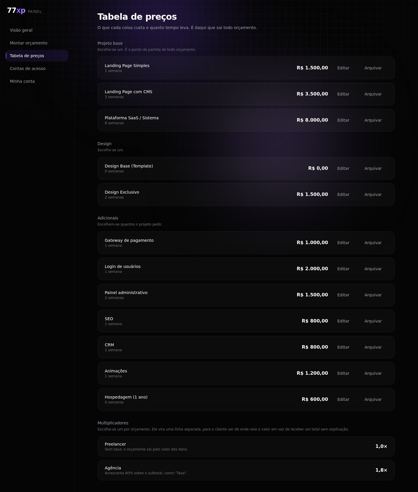
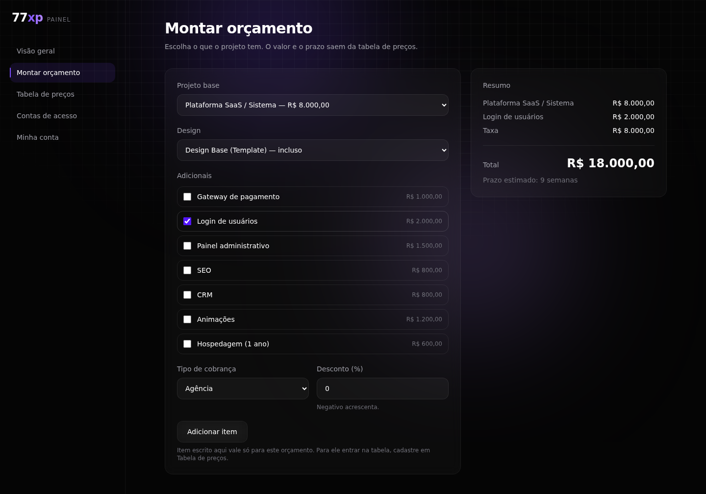

# Etapa 2 — Preços e orçamentos

**Estado:** primeira parte pronta (tabela de preços e simulador). Faltam a proposta em
PDF e a cobrança.
**Onde mora:** `os/backend/.../catalog` e `os/frontend/src/pages/panel`

---

## O problema que esta etapa resolve

O sistema tinha **quatro tabelas de preço**, escritas em quatro arquivos diferentes, e
as quatro discordavam:

| Onde | SaaS / Sistema | E-commerce | Padrão |
|---|---:|---:|---:|
| Calculadora do site (o cliente vê) | R$ 45.000 | R$ 60.000 | R$ 30.000 |
| Proposta do admin (você manda) | R$ 15.000 | R$ 7.500 | R$ 4.000 |
| Painel do admin (seu forecast) | R$ 15.000 | R$ 8.000 | R$ 1.500 |
| Calculadora separada | R$ 8.000 | — | — |

Ninguém decidiu isso. Foi acontecendo, um número por vez, cada um num lugar. O pior é
que a terceira é a que calcula o seu **Ticket Médio** e o seu **forecast** — os números
que você usa para decidir onde investir seu tempo.

Agora existe **uma**, no banco, editável por você.

---

## As telas

### Tabela de preços (`/painel/precos`)

O que cada coisa custa e quanto tempo leva. Editável a qualquer momento, sem depender de
ninguém.

O modelo veio da sua **Calculadora-or-amentos**, que é a única das quatro que não tem
"preço do projeto": ela soma itens. Três grupos:

- **Projeto base** — escolhe-se um
- **Design** — escolhe-se um
- **Adicionais** — escolhem-se quantos o projeto pedir

E os **multiplicadores** (Freelancer 1,0× · Agência 1,8×), que viram uma linha chamada
"Taxa" no orçamento, em vez de sumirem dentro do total.

Item que sai de uso é **arquivado, não apagado**: uma proposta antiga precisa continuar
mostrando o que foi cobrado, não o preço de hoje. E o nome de um item arquivado volta a
ficar livre.

Toda alteração de preço vai para a trilha de auditoria **com o valor anterior** — a
trilha do admin antigo só guarda o valor novo, então lá não dá para saber de quanto para
quanto uma coisa mudou.

### Montar orçamento (`/painel/orcamento`)

Escolhe os itens e vê o valor e o prazo na hora.

Duas regras que costumam ser erradas e aqui estão cobertas por teste:

- **A taxa não acrescenta prazo.** Cobrar como agência não faz o trabalho demorar mais.
- **O desconto incide sobre o subtotal**, não sobre o total com taxa. Com 1,8× e 10% de
  desconto, os 10% saem de R$ 8.000 (R$ 800), não de R$ 14.400.

Item escrito na hora entra na conta e **não** vai para a tabela.

---

## Por que a conta existe em dois lugares

A mesma conta está em Java e em TypeScript. Isso normalmente é erro — foi assim que
nasceram as quatro tabelas.

Aqui é decisão: o simulador precisa responder a cada clique, e pedir ao servidor a cada
marcação deixaria a tela lenta. O Java continua sendo a verdade na hora de emitir uma
proposta.

O que impede as duas de divergirem é `os/contratos/casos-de-orcamento.json`: **os dois
lados rodam os mesmos oito casos**. Se um mudar e o outro não, o CI quebra.

Testado de propósito: mudando só o lado JavaScript para descontar sobre o total em vez
de sobre o subtotal, o teste apontou o caso exato.

---

## Nunca mais uma quinta tabela

O `NoHardcodedPricesTest` procura números que pareçam preço escritos em código e falha
se achar algum fora da migração que semeia o catálogo.

Testado: ao acrescentar um `PRECO_SAAS = 4500000` no meio do código, o CI apontou o
arquivo e a linha.

---

## O que falta nesta etapa

- **Proposta em PDF** pelo navegador, com assinatura — como na sua calculadora.
- **Mandar a proposta** para o cliente e **cobrar** pelo Stripe.
- **Aposentar as três tabelas do site Next.js.** Elas continuam lá até o OS substituir o
  `/admin`, na etapa 4.

## O que continua sendo seu

Esta etapa **não escolheu** quais preços são os certos. Ela semeou com os da sua
calculadora e te deu a tela.

Corrigir cada valor leva um minuto agora, em vez de um pedido de alteração.
